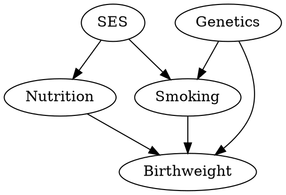

# CausalCert — Causal Robustness Radii

**Certifying the stability of causal conclusions under structural perturbations.**

CausalCert computes the *robustness radius* of a causal conclusion — the minimum
number of edge insertions, deletions, or reversals to an assumed causal DAG that
would overturn a given statistical or causal finding.  A large radius certifies
that the conclusion is insensitive to moderate mis-specification; a small radius
(with an explicit witness edit set) flags fragility.

---

## Table of Contents

- [Architecture Overview](#architecture-overview)
- [Module Map](#module-map)
- [Installation](#installation)
- [Quick Start](#quick-start)
- [Detailed API Reference](#detailed-api-reference)
- [CLI Usage](#cli-usage)
- [Configuration Reference](#configuration-reference)
- [Theory Overview](#theory-overview)
- [File Format Specifications](#file-format-specifications)
- [Examples](#examples)
- [Benchmarks](#benchmarks)
- [FAQ](#faq)
- [Contributing](#contributing)
- [License](#license)

---

## Architecture Overview

CausalCert is organised into loosely coupled modules connected by a central
pipeline orchestrator.  Data flows top-down through the diagram; each module
communicates via typed dataclasses defined in `causalcert.types`.

```
                       ┌────────────────────┐
                       │     User Input      │
                       │  DAG · Data · Conf  │
                       └────────┬───────────┘
                                │
                                ▼
┌──────────────────────────────────────────────────────────────────┐
│                   Pipeline Orchestrator (ALG 8)                  │
│   config · CLI · parallel dispatch · structured logging          │
│   checkpoint / resume · progress callbacks · memory management   │
└──┬──────────────┬──────────────┬──────────────┬─────────────────┘
   │              │              │              │
   ▼              ▼              ▼              ▼
┌──────┐   ┌──────────┐   ┌─────────┐   ┌──────────┐
│  DAG │   │ CI Tests │   │ Solver  │   │Estimation│
│Module│   │  Module  │   │ Module  │   │  Module  │
│      │   │          │   │         │   │          │
│graph │   │partial   │   │ ILP     │   │ AIPW     │
│dsep  │   │rank      │   │ LP      │   │ backdoor │
│moral │   │kernel    │   │ FPT-DP  │   │ crossfit │
│MEC   │   │CRT       │   │ CDCL    │   │propensity│
│edit  │   │ensemble  │   │ search  │   │ outcome  │
└──┬───┘   └────┬─────┘   └────┬────┘   └────┬─────┘
   │            │              │              │
   │  ┌────────┴────────┐     │              │
   │  │   Fragility      │     │              │
   │  │   Scorer (ALG 3) │◄────┘              │
   │  │   channels · BFS │                    │
   │  │   ranking · agg  │                    │
   │  └─────────────────┘                    │
   │                                          │
   ▼                                          ▼
┌──────┐                               ┌──────────┐
│ Data │                               │Reporting │
│  I/O │                               │  Module  │
│      │                               │          │
│loader│                               │ JSON     │
│synth │                               │ HTML     │
│valid │                               │ LaTeX    │
│dagIO │                               │ visual   │
└──────┘                               └──────────┘
```

### Execution Flow

1. **Validate** — check DAG acyclicity, data shape, column alignment.
2. **CI Testing** — run conditional-independence tests on all node pairs
   (with caching and multiplicity correction).
3. **Fragility Scoring** — per-edge fragility across three channels:
   d-separation, identification, and estimation impact.
4. **Radius Computation** — solve for the minimum edit set that overturns
   the causal conclusion (ILP / LP / FPT / CDCL).
5. **Estimation** — compute the causal effect (ATE) via AIPW or back-door.
6. **Reporting** — assemble an `AuditReport` and render to JSON/HTML/LaTeX.

---

## Module Map

| Module | Purpose | Key Algorithms |
|--------|---------|----------------|
| `causalcert.dag` | DAG representation, d-separation, moral graphs, MEC, structural edits | ALG 1 (ancestors), ALG 2 (incremental d-sep) |
| `causalcert.ci_testing` | Conditional independence testing with multiplicity control | ALG 6 (Cauchy combination) |
| `causalcert.solver` | ILP / LP / FPT / CDCL solvers for robustness radius | ALG 4 (ILP), ALG 5 (LP relax), ALG 7 (FPT-DP) |
| `causalcert.fragility` | Per-edge fragility scoring and ranking | ALG 3 (fragility scorer) |
| `causalcert.estimation` | Causal effect estimation (AIPW, back-door, cross-fitting) | — |
| `causalcert.data` | Data loading (CSV/Parquet), validation, synthetic generation, DAG I/O | — |
| `causalcert.pipeline` | Orchestrator, CLI, caching, parallel execution, checkpointing | ALG 8 (full pipeline) |
| `causalcert.reporting` | Audit reports in JSON / HTML / LaTeX, visualisation, narrative | — |
| `causalcert.evaluation` | Benchmarks, DGPs, ablations, scalability, published DAGs | — |
| `causalcert.utils` | Math, graph, statistics, I/O, and parallel helpers | — |
| `causalcert.benchmarks` | Standard benchmarks, stress tests, cross-method comparisons | — |

### File Tree

```
causalcert/
├── __init__.py          # Public exports, version
├── types.py             # Core dataclasses, enums, Protocols
├── config.py            # Global env-var configuration
├── exceptions.py        # Exception hierarchy
├── dag/                 # Graph operations (10 files, ~4.5k lines)
├── ci_testing/          # CI tests & multiplicity (10 files, ~5.6k lines)
├── solver/              # Robustness-radius solvers (8 files, ~4.7k lines)
├── fragility/           # Per-edge scoring (6 files, ~3.8k lines)
├── estimation/          # Causal effect estimation (9 files, ~4.0k lines)
├── data/                # Data I/O and synthesis (7 files, ~2.6k lines)
├── pipeline/            # Orchestrator & CLI (7 files, ~3.9k lines)
├── reporting/           # Report generation (7 files, ~2.5k lines)
├── evaluation/          # Benchmark runners (9 files, ~4.4k lines)
├── utils/               # Utility helpers (5 files, ~1.6k lines)
└── benchmarks/          # Benchmark suite (3 files, ~1.1k lines)
```

---

## Installation

### From Source (Recommended for Development)

```bash
git clone https://github.com/causalcert/causalcert.git
cd causalcert
pip install -e ".[dev]"
```

### From PyPI (Once Published)

```bash
pip install causalcert
```

### Requirements

- **Python** ≥ 3.10
- **Core dependencies** (installed automatically):
  - `networkx ≥ 3.1`
  - `numpy ≥ 1.24`
  - `scipy ≥ 1.10`
  - `scikit-learn ≥ 1.3`
  - `pandas ≥ 2.0`
  - `pyarrow ≥ 12.0`
  - `click ≥ 8.1`
  - `jinja2 ≥ 3.1`
  - `python-mip ≥ 1.15`

### Optional Extras

```bash
# Development tools (pytest, mypy, ruff)
pip install -e ".[dev]"

# Documentation (Sphinx)
pip install -e ".[docs]"
```

### Verify Installation

```bash
python -c "import causalcert; print(causalcert.__version__)"
# → 0.1.0
```

---

## Quick Start

### Python API — Minimal Example

```python
import numpy as np
import pandas as pd
from causalcert.pipeline.orchestrator import CausalCertPipeline
from causalcert.pipeline.config import PipelineRunConfig
from causalcert.types import SolverStrategy

# 1. Define a DAG as an adjacency matrix
#    Nodes: 0=Confounder, 1=Treatment, 2=Mediator, 3=Outcome
adj = np.array([
    [0, 1, 1, 0],   # Confounder → Treatment, Mediator
    [0, 0, 0, 1],   # Treatment → Outcome
    [0, 0, 0, 1],   # Mediator → Outcome
    [0, 0, 0, 0],   # Outcome (sink)
])

# 2. Load or generate observational data
data = pd.DataFrame(
    np.random.default_rng(42).standard_normal((1000, 4)),
    columns=["Confounder", "Treatment", "Mediator", "Outcome"],
)

# 3. Configure and run
config = PipelineRunConfig(
    treatment=1,       # Treatment node index
    outcome=3,         # Outcome node index
    alpha=0.05,        # Significance level
    solver_strategy=SolverStrategy.AUTO,
)
pipeline = CausalCertPipeline(config)
report = pipeline.run(adj_matrix=adj, data=data)

# 4. Inspect results
print(f"Robustness radius: [{report.radius.lower_bound}, "
      f"{report.radius.upper_bound}]")
for fs in report.fragility_ranking[:3]:
    print(f"  Edge {fs.edge}: fragility={fs.total_score:.4f}")
```

### Python API — Synthetic Data

```python
from causalcert.data.synthetic import generate_linear_gaussian

# Generate data from a linear-Gaussian SEM
df, W = generate_linear_gaussian(
    adj, n=2000, noise_scale=1.0,
    edge_weight_range=(0.5, 1.5), seed=42,
)
```

### CLI — Quick Fragility Scan

```bash
causalcert fragility --dag dag.dot --data obs.csv --top-k 10
```

### CLI — Full Audit

```bash
causalcert audit --dag dag.dot --data obs.parquet \
    --treatment X --outcome Y \
    --output report.html --format html
```

---

## Detailed API Reference

### Core Types (`causalcert.types`)

```python
# Enumerations
EditType          # ADD, DELETE, REVERSE
FragilityChannel  # D_SEPARATION, IDENTIFICATION, ESTIMATION
SolverStrategy    # ILP, LP_RELAXATION, FPT, CDCL, AUTO
VariableType      # CONTINUOUS, ORDINAL, NOMINAL, BINARY

# Dataclasses
StructuralEdit(edit_type, source, target)
CITestResult(x, y, conditioning_set, statistic, p_value, method)
FragilityScore(edge, score, channel_scores)
RobustnessRadius(lower_bound, upper_bound, witness_edits, solver_used)
EstimationResult(estimate, std_error, ci_lower, ci_upper, method)
AuditReport(treatment, outcome, radius, fragility_ranking,
            estimation_result, ci_results, metadata)
```

### Pipeline (`causalcert.pipeline`)

```python
from causalcert.pipeline.orchestrator import CausalCertPipeline
from causalcert.pipeline.config import PipelineRunConfig

# PipelineRunConfig fields:
#   treatment: int           — treatment node index
#   outcome: int             — outcome node index
#   alpha: float = 0.05      — significance level
#   solver_strategy: SolverStrategy — AUTO, ILP, LP_RELAXATION, FPT, CDCL
#   ci_test_method: str       — "ensemble", "partial_correlation", etc.

pipeline = CausalCertPipeline(config, progress_callback=None, checkpoint=None)
report = pipeline.run(adj_matrix=adj, data=df, predicate=None)
# Returns: AuditReport
```

### DAG Module (`causalcert.dag`)

```python
from causalcert.dag.graph import CausalDAG
from causalcert.dag.dsep import DSeparationOracle
from causalcert.dag.conversions import from_dot, from_json, to_dot
from causalcert.dag.edit import apply_edit
from causalcert.dag.moral import moral_graph
from causalcert.dag.mec import to_cpdag, enumerate_mec

dag = CausalDAG(adj_matrix=adj, node_names=["A", "B", "C", "D"])
dot_string = to_dot(adj, node_names=["A", "B", "C", "D"])
adj, names = from_dot("digraph { A -> B; B -> C; }")
```

### CI Testing (`causalcert.ci_testing`)

```python
from causalcert.ci_testing.partial_corr import PartialCorrelationTest
from causalcert.ci_testing.kci import KernelCITest
from causalcert.ci_testing.ensemble import CauchyCombinationTest

# All CI tests implement the CITest Protocol:
#   test(x, y, z, data) -> CITestResult
```

### Fragility (`causalcert.fragility`)

```python
from causalcert.fragility.scorer import FragilityScorerImpl
from causalcert.fragility.ranking import rank_edges, EdgeSeverity

# EdgeSeverity thresholds:
#   CRITICAL  ≥ 0.7
#   IMPORTANT ∈ [0.4, 0.7)
#   MODERATE  ∈ [0.1, 0.4)
#   COSMETIC  < 0.1
```

### Solvers (`causalcert.solver`)

```python
from causalcert.solver.ilp import ILPSolver           # ALG 4 — exact
from causalcert.solver.lp_relaxation import LPRelaxationSolver  # ALG 5 — bounds
from causalcert.solver.fpt import FPTSolver             # ALG 7 — treewidth
from causalcert.solver.cdcl import CDCLSolver           # CDCL search
from causalcert.solver.search import UnifiedSolver       # unified search
```

### Estimation (`causalcert.estimation`)

```python
from causalcert.estimation.aipw import AIPWEstimator
from causalcert.estimation.backdoor import satisfies_backdoor, enumerate_adjustment_sets
from causalcert.estimation.adjustment import find_optimal_adjustment_set
```

### Reporting (`causalcert.reporting`)

```python
from causalcert.reporting.json_report import to_json_report
from causalcert.reporting.html_report import to_html_report
from causalcert.reporting.latex_report import to_latex_tables
```

### Data (`causalcert.data`)

```python
from causalcert.data.loader import load_csv
from causalcert.data.synthetic import generate_linear_gaussian
from causalcert.data.dag_io import load_dag, save_dag
```

### Utilities (`causalcert.utils`)

```python
from causalcert.utils.math_utils import (
    nearest_positive_definite, spectral_radius, safe_log, powerset,
)
from causalcert.utils.graph_utils import (
    bfs_shortest_path, all_simple_paths, descendants, ancestors,
    topological_sort, connected_components, density, diameter,
)
from causalcert.utils.stat_utils import (
    cauchy_combine, fisher_exact_combine, benjamini_hochberg,
    bootstrap_statistic, wald_ci, gaussian_kernel_matrix, mmd_squared,
)
from causalcert.utils.io_utils import (
    detect_format, atomic_write, NumpyEncoder, sha256_file,
    ProgressReporter,
)
from causalcert.utils.parallel_utils import (
    parallel_map, split_into_chunks, memory_bounded_map, retry,
)
```

### Benchmarks (`causalcert.benchmarks`)

```python
from causalcert.benchmarks.standard import (
    list_benchmarks, get_benchmark, generate_benchmark_data,
    validate_against_baseline,
)
from causalcert.benchmarks.stress import run_stress_suite
from causalcert.benchmarks.compare import (
    run_full_comparison, format_comparison_report, compute_e_value,
)
```

---

## CLI Usage

CausalCert provides a Click-based CLI with the following commands:

### `causalcert audit`

Run the full robustness audit.

```bash
causalcert audit \
    --dag dag.dot \
    --data observations.csv \
    --treatment SmokingStatus \
    --outcome Birthweight \
    --alpha 0.05 \
    --solver auto \
    --output report.html \
    --format html \
    --seed 42
```

**Flags:**

| Flag | Type | Default | Description |
|------|------|---------|-------------|
| `--dag` | PATH | (required) | Path to DAG file (DOT, JSON, GML) |
| `--data` | PATH | (required) | Path to data file (CSV, Parquet) |
| `--treatment` | TEXT | (required) | Treatment variable name or index |
| `--outcome` | TEXT | (required) | Outcome variable name or index |
| `--alpha` | FLOAT | 0.05 | Significance level |
| `--solver` | TEXT | auto | Solver strategy |
| `--ci-test` | TEXT | ensemble | CI test method |
| `--output` | PATH | stdout | Output file |
| `--format` | TEXT | json | Output format (json, html, latex) |
| `--seed` | INT | None | Random seed |
| `--n-jobs` | INT | 1 | Parallel workers |
| `--verbose` | FLAG | — | Enable debug logging |

### `causalcert fragility`

Quick fragility scan without full radius computation.

```bash
causalcert fragility --dag dag.dot --data obs.csv --top-k 10
```

### `causalcert validate`

Check DAG and data files for issues without running the analysis.

```bash
causalcert validate --dag dag.dot --data obs.csv
```

---

## Configuration Reference

### `PipelineRunConfig`

The main configuration object, passed to `CausalCertPipeline.__init__`.

| Field | Type | Default | Description |
|-------|------|---------|-------------|
| `treatment` | `int` | — | Treatment node index |
| `outcome` | `int` | — | Outcome node index |
| `alpha` | `float` | `0.05` | Type-I error rate |
| `solver_strategy` | `SolverStrategy` | `SolverStrategy.AUTO` | `ILP`, `LP_RELAXATION`, `FPT`, `CDCL`, `AUTO` |
| `ci_test_method` | `str` | `"ensemble"` | CI test to use |

### `CITestConfig`

| Field | Type | Default | Description |
|-------|------|---------|-------------|
| `method` | `str` | `"ensemble"` | Test method |
| `alpha` | `float` | `0.05` | Per-test significance |
| `max_conditioning_size` | `int` | `None` | Max |Z| |
| `ensemble_methods` | `list[str]` | `["partial_correlation", "rank", "kernel"]` | Methods for ensemble |
| `adaptive_weights` | `bool` | `True` | Data-driven ensemble weights |

### `SolverConfig`

| Field | Type | Default | Description |
|-------|------|---------|-------------|
| `strategy` | `str` | `"auto"` | Solver selection |
| `k_max` | `int` | `10` | Maximum edit budget |
| `time_limit_s` | `float` | `600` | Solver wall-clock limit |
| `max_treewidth_for_fpt` | `int` | `8` | Threshold for FPT |
| `gap_tolerance` | `float` | `0.0` | Acceptable integrality gap |

### `EstimationConfig`

| Field | Type | Default | Description |
|-------|------|---------|-------------|
| `estimator` | `str` | `"aipw"` | `"aipw"` or `"backdoor"` |
| `n_folds` | `int` | `5` | Cross-fitting folds |
| `propensity_model` | `str` | `"logistic"` | Model for P(T|X) |
| `outcome_model` | `str` | `"linear"` | Model for E[Y|T,X] |

### `ReportingConfig`

| Field | Type | Default | Description |
|-------|------|---------|-------------|
| `format` | `str` | `"json"` | Output format |
| `detail_level` | `str` | `"standard"` | `"minimal"`, `"standard"`, `"full"` |
| `include_plots` | `bool` | `True` | Embed visualisations |

### Environment Variables

| Variable | Description |
|----------|-------------|
| `CAUSALCERT_CACHE_DIR` | Cache directory (default: `.causalcert_cache`) |
| `CAUSALCERT_LOG_LEVEL` | Logging level (default: `INFO`) |
| `CAUSALCERT_N_JOBS` | Default parallel workers |
| `CAUSALCERT_SEED` | Default RNG seed |

---

## Theory Overview

### What Problem Does CausalCert Solve?

In observational causal inference, conclusions depend on a *causal DAG* that
encodes domain assumptions.  If the DAG is wrong — even by a single edge —
the conclusion may change.  CausalCert quantifies this fragility.

### Key Concept: Robustness Radius

Given:
- A causal DAG **G** (adjacency matrix)
- Observational data **D**
- A causal conclusion **C** (e.g., "X causes Y with ATE > 0")

The **robustness radius** *r* is the smallest integer such that there
exist *r* single-edge edits (additions, deletions, or reversals) to **G**
producing a DAG **G'** under which the conclusion **C** no longer holds.

```
r = min { |S| : S is a set of edge edits, G' = G ⊕ S is a DAG,
                and C does not hold under G' given D }
```

### Three Fragility Channels

Each edge is scored across three channels:

1. **D-Separation** — Does editing this edge change which conditional
   independencies hold?
2. **Identification** — Does editing this edge change whether the causal
   effect is identified (e.g., back-door, front-door)?
3. **Estimation** — Does editing this edge change the estimated causal
   effect significantly?

### Algorithms

| Algorithm | Description | Complexity |
|-----------|-------------|------------|
| ALG 1 | Ancestral set computation | O(V + E) |
| ALG 2 | Incremental d-separation after edge edits | O(V²) amortised |
| ALG 3 | Per-edge fragility scorer | O(E · V²) |
| ALG 4 | ILP for exact robustness radius | NP-hard (practical for V ≤ 50) |
| ALG 5 | LP relaxation for lower bound | Polynomial |
| ALG 6 | Cauchy combination for CI-test ensembles | O(k) per test |
| ALG 7 | FPT-DP on tree decomposition | O(2^tw · V) |
| ALG 8 | Pipeline orchestrator | Composition of ALG 1–7 |

---

## File Format Specifications

### DOT Format (Graphviz)



- Use `digraph` (directed graph).
- Node names may be quoted (`"Blood Pressure"`) or unquoted.
- Attributes (e.g., `[color=red]`) are ignored.

### JSON Format

```json
{
  "nodes": ["SES", "Smoking", "Nutrition", "Birthweight", "Genetics"],
  "edges": [
    ["SES", "Smoking"],
    ["SES", "Nutrition"],
    ["Smoking", "Birthweight"],
    ["Nutrition", "Birthweight"],
    ["Genetics", "Birthweight"],
    ["Genetics", "Smoking"]
  ]
}
```

### CSV Data Format

```csv
SES,Smoking,Nutrition,Birthweight,Genetics
1.2,0.8,-0.3,2.1,0.5
...
```

- First row must be a header matching node names in the DAG.
- All values must be numeric (continuous, ordinal, or binary).
- Missing values: use empty cells or `NA`.

### Parquet Data Format

Same schema as CSV but stored in Apache Parquet for efficiency.
Load with:

```python
from causalcert.data.loader import load_csv  # also handles Parquet
```

### Adjacency-Matrix NPZ

```python
import numpy as np
np.savez_compressed("dag.npz", adj=adj_matrix)
```

---

## Examples

The `examples/` directory contains runnable scripts:

| Script | Description |
|--------|-------------|
| `quickstart.py` | End-to-end: synthetic DAG → data → pipeline → results |
| `published_dag_analysis.py` | Analyse all 15 published benchmark DAGs |
| `custom_dag.py` | Specify DAGs via DOT, JSON, or matrix; generate HTML report |
| `comparison_methods.py` | Compare CI tests, solvers, and convergence |
| `synthetic_benchmarks.py` | Scalability curves, profiling, graph-type comparison |
| `sensitivity_to_faithfulness.py` | Near-faithfulness violations and power envelope |

Run any example from the repository root:

```bash
python examples/quickstart.py
python examples/published_dag_analysis.py --samples 2000
python examples/synthetic_benchmarks.py --max-nodes 40
```

---

## Benchmarks

### Standard Benchmarks

```python
from causalcert.benchmarks.standard import list_benchmarks, get_benchmark

print(list_benchmarks())
# ['chain-5', 'chain-10', 'fork', 'collider', 'mediator', 'iv',
#  'backdoor', 'frontdoor', 'diamond', 'napkin', 'bow']

b = get_benchmark("diamond")
print(b.description)       # "Diamond X→M1,M2→Y"
print(b.expected_radius_range)  # (2, 4)
```

### Stress Tests

```python
from causalcert.benchmarks.stress import run_stress_suite

suite = run_stress_suite(seed=42, n_samples=500)
print(suite.summary())
```

### Cross-Method Comparison

```python
from causalcert.benchmarks.compare import run_full_comparison, format_comparison_report

report = run_full_comparison(adj, data, names, treatment=1, outcome=3)
print(format_comparison_report(report))
```

---

## FAQ

**Q: How large a DAG can CausalCert handle?**
A: The ILP solver works well for up to ~50 nodes.  For larger graphs, use the
LP relaxation (provides bounds in polynomial time) or the FPT solver if the
treewidth is ≤ 8.  The CI-testing and fragility-scoring steps scale to
hundreds of nodes.

**Q: What if my DAG has latent (unmeasured) variables?**
A: CausalCert currently assumes all variables in the DAG are observed.  For
latent confounders, consider using the E-value (for unmeasured confounding
sensitivity) alongside CausalCert (for structural sensitivity).

**Q: Can I use non-linear data?**
A: Yes.  The kernel CI test (`kci`) and CRT handle non-linear relationships.
Use `ci_test_method="kernel"` or the default ensemble.

**Q: What does a radius of 0 mean?**
A: The causal conclusion is already not supported by the data under the given
DAG.  Check whether the treatment–outcome path is blocked.

**Q: How do I interpret the fragility channels?**
A: D-separation fragility means the edge is critical for conditional
independence structure.  Identification fragility means it affects whether
the causal effect can be estimated at all.  Estimation fragility means it
changes the numerical estimate significantly.

**Q: Can I plug in my own CI test?**
A: Yes — implement the `CITest` Protocol defined in `causalcert.types` and
pass it to the pipeline configuration.

**Q: Is CausalCert deterministic?**
A: Yes, when a seed is provided.  All randomised components (bootstrap,
synthetic data, cross-fitting) use `numpy.random.Generator` seeded from the
provided seed.

**Q: How does CausalCert relate to sensitivity analysis?**
A: Traditional sensitivity analysis (e.g., E-value) asks "how much unmeasured
confounding is needed?"  CausalCert asks "how many structural edits to the
DAG are needed?"  They address complementary threat models.

---

## Contributing

### Development Setup

```bash
git clone https://github.com/causalcert/causalcert.git
cd causalcert
pip install -e ".[dev]"
```

### Running Tests

```bash
pytest                           # all tests
pytest tests/ -x --tb=short      # stop on first failure
pytest tests/ -k "test_dag"      # filter by name
```

### Type Checking

```bash
mypy causalcert/
```

### Linting

```bash
ruff check causalcert/
ruff format causalcert/
```

### Code Style

- **Line length**: 99 characters.
- **Type annotations**: required on all public functions.
- **Docstrings**: NumPy style.
- **Imports**: sorted by `isort` via `ruff`.

### Adding a New CI Test

1. Create `causalcert/ci_testing/my_test.py`.
2. Implement the `CITest` Protocol (see `causalcert/types.py`).
3. Register in `causalcert/ci_testing/__init__.py`.
4. Add tests in `tests/test_ci_testing/`.

### Adding a New Solver

1. Create `causalcert/solver/my_solver.py`.
2. Implement the `Solver` Protocol.
3. Register in `causalcert/solver/__init__.py`.
4. Add tests and a benchmark in `causalcert/benchmarks/standard.py`.

---

## Design Principles

1. **Typed throughout** — dataclasses, enums, Protocols, TypeAlias everywhere.
2. **Algorithm-first** — every solver maps to a numbered algorithm in the paper.
3. **Incremental** — d-separation and CI caches support warm-start after edits.
4. **Reproducible** — deterministic seeds, structured JSON logs, full provenance.
5. **Extensible** — new CI tests, solvers, and estimators via Protocols.

---

## License

MIT
